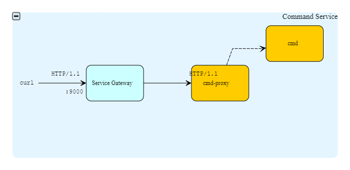

# Command Service

A micro servcie for executing commands.

This is built using [Lagom](https://www.lagomframework.com/) an open source framework for developing reactive microservice systems in Java or Scala.

This Guide describes how to build and run the service. 
The docs folder contains more details about this service, project structure and deployment diagram.


## Building the code

Pre-requisite : A recent Maven version (recommend to be at least Maven 3.3) and Java 1.8.

```bash
cd cmd-service
mvn clean install
```
The above mvn command will compile and run unit tests as well as Integration tests.
The first time the above mvn command is run, it will take some time to resolve and download dependencies.

## Running the example

Use the `mvn lagom:runAll` command to start the Command service:

```bash
cmd-service> mvn lagom:runAll
```

The `runAll` command starts Lagom in development mode. Once all the services are started you will see Lagom's start message:

```
...
[INFO] Service locator is running at http://127.0.0.1:9008
[INFO] Service gateway is running at http://127.0.0.1:9000
[info] Service cmd-proxy-impl listening for HTTP on 127.0.0.1:54328
[info] Service cmd-impl listening for HTTP on 127.0.0.1:65499

[info] (Services started, press enter to stop and go back to the console...)
```

As soon as you see the message `[info] (Services started, press enter to stop and go back to the console...)` you can proceed.
 
On a separate terminal, try the application:

```bash
$ curl -w "\n" -d '{"task":"add", "payload":"1.1,2.1"}' -H "Content-Type: application/json" -X POST http://localhost:9000/proxy/rest-cmd/
{"task":"add","payload":"1.1,2.1","result":"3.2"}


```

## API Documentation

This application is built with two Lagom services (`cmd` and `cmd-proxy`) exposing the following endpoints:

```
POST /proxy/rest-cmd/        # served by cmd-proxy-service (HTTP-JSON)
POST /api/cmd/               # served by cmd-service (HTTP-JSON)
```

```
The input for the cmd-proxy service is defined using a Job.
The result of the Job execution is provided by JobResult.

Refer to docs/API.txt for details about the JSON representation.
 
```

While the `cmd-service` always returns computed values the `cmd-proxy` always forwards the request downstream to `cmd-service`.

And also:
Lagom provides Service Gateway for accessing the above service endpoints.





So when you invoke:

```bash
$ curl -w "\n" -d '{"task":"add", "payload":"1.1,2.1"}' -H "Content-Type: application/json" -X POST http://localhost:9000/proxy/rest-cmd/
```

The following happens:

```
curl  --(http)-->  service gateway  --(http)-->  cmd-proxy-service  --(http)-->  cmd-service
```
## Notable Design choices

CircuitBreaker used by cmd-proxy-service invoking cmd-service.

Java CompletionStage API for async handling and composing cross cutting concerns (logging).


Jacoco code coverage : 70%

PMD and CheckStyle.

Integration tests and Load tests.


## References

- [Lagom](https://www.lagomframework.com/)
- [CircuitBreaker](https://www.lagomframework.com/documentation/1.5.x/java/ServiceClients.html#Circuit-Breakers)

